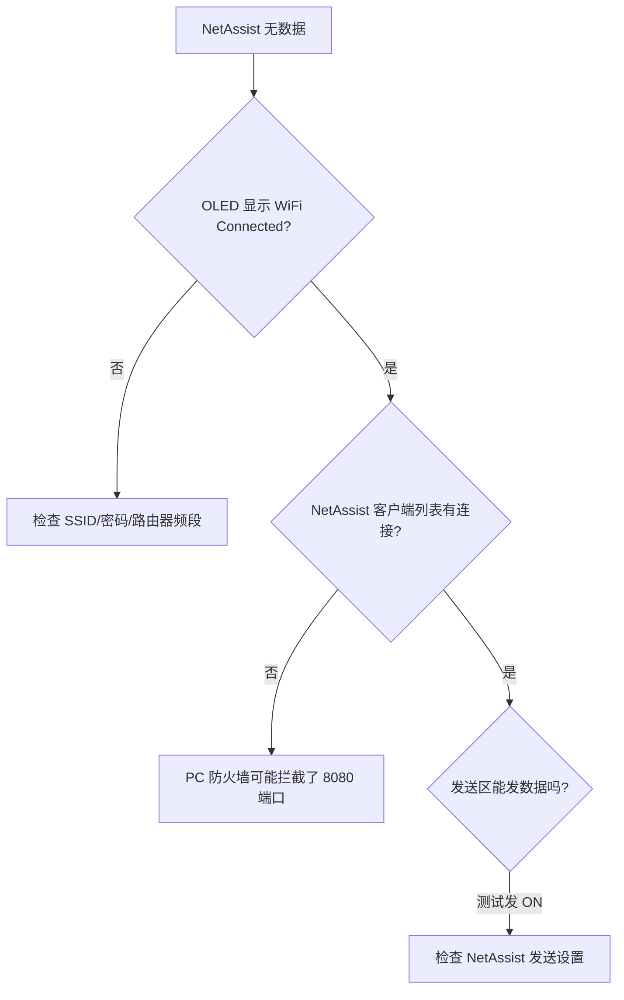

# PC 端联调傻瓜式操作指南

> **适用场景**: STM32F103C8T6 + ESP8266-01 WiFi 透传 → PC 端网络调试助手  
> **目标读者**: 嵌入式测试工程师 / 项目验收人员  
> **预计耗时**: 5 分钟完成全部配置

---

## 一、前置准备

### 1.1 确保硬件连接正确

| 单片机引脚 | ESP8266-01 引脚 | 说明 |
|:---:|:---:|:---|
| PA2 (USART2_TX) | RXD | 单片机发 → 模块收 |
| PA3 (USART2_RX) | TXD | 模块发 → 单片机收 |
| 3.3V | VCC, CH_PD (EN) | **必须 3.3V 供电, 严禁 5V!** |
| GND | GND, GPIO0 | GPIO0 悬空或拉高 = 运行模式 |

> ⚠️ **致命警告**: ESP8266 的 VCC 必须用 **3.3V** 供电。STM32F103 的 5V 直供会烧毁 WiFi 模块。  
> 建议使用独立的 3.3V LDO (如 AMS1117-3.3) 提供 ≥500mA 电流，因为 WiFi 发射瞬时电流可高达 300mA。

### 1.2 确保单片机固件已烧录

单片机 `main.c` 中需要修改三处配置后重新编译烧录：

```c
#define WIFI_SSID       "YourWiFiSSID"      // ← 改成你公司的 WiFi 名
#define WIFI_PASSWORD   "YourWiFiPassword"  // ← 改成 WiFi 密码
#define SERVER_IP       "192.168.1.100"     // ← 改成 PC 的 IP 地址 (见下文)
#define SERVER_PORT     8080                // ← 端口号, 保持 8080 即可
```

---

## 二、获取 PC 端 IP 地址

### 2.1 打开命令行

按 `Win + R` → 输入 `cmd` → 回车

### 2.2 查询 IPv4 地址

```batch
ipconfig
```

在输出中找到**当前使用的网络适配器**（通常名称包含 "Wi-Fi" / "无线" / "以太网" / "WLAN"），其下的 `IPv4 地址` 一行即为你的 PC IP。

```
无线局域网适配器 WLAN:

   连接特定的 DNS 后缀 . . . . . . . :
   本地链接 IPv6 地址 . . . . . . . . : fe80::xxxx:xxxx:xxxx:xxxx%12
   IPv4 地址 . . . . . . . . . . . . : 192.168.1.100    ← 这就是你要的 IP
   子网掩码  . . . . . . . . . . . . : 255.255.255.0
   默认网关. . . . . . . . . . . . . : 192.168.1.1
```

> 📌 **注意事项**:
> - PC 和 ESP8266 必须连接**同一个路由器 / 热点**，否则 IP 不在同一网段无法通信。
> - 如果电脑同时有多个网卡（有线 + 无线 + 虚拟机虚拟网卡），请选择 ESP8266 实际连接的那个网络。
> - 将该 IP 地址填入 `main.c` 的 `SERVER_IP` 宏定义中并重新编译烧录。

---

## 三、一键部署网络调试助手

### 3.1 运行自动化脚本

在项目目录 `Tools\` 下找到 `deploy_netassist.ps1`，右键选择 **"使用 PowerShell 运行"**。

脚本会自动执行:
1. 创建 `D:\NetAssist` 文件夹
2. 从 GitHub 下载免安装版 NetAssist
3. 自动启动网络调试助手

> 如果 PowerShell 执行策略阻止脚本运行，先在管理员 PowerShell 中执行:
> ```powershell
> Set-ExecutionPolicy -Scope CurrentUser -ExecutionPolicy RemoteSigned
> ```

### 3.2 手动下载备选方案

如果自动下载失败（例如公司防火墙限制），可以:
1. 浏览器搜索 **"网络调试助手 NetAssist 免安装"**
2. 下载后将 `NetAssist.exe` 手动放到 `D:\NetAssist\`
3. 双击运行

---

## 四、配置 NetAssist 为 TCP 服务器

### 4.1 软件主界面说明

启动后界面分为上中下三栏:

```
┌─────────────────────────────────────┐
│  [协议类型] [本地主机地址] [端口]    │  ← 配置栏
│  [开启监听] [停止监听] [清除数据]    │  ← 操作按钮
├─────────────────────────────────────┤
│                                     │
│         数据接收/发送区域            │  ← 日志区
│                                     │
├─────────────────────────────────────┤
│  [发送数据输入框]        [发送]     │  ← 发送区
└─────────────────────────────────────┘
```

### 4.2 五步配置法

| 步骤 | 操作 | 设置值 |
|:---:|:---|:---|
| **①** | 协议类型下拉框 | 选择 **"TCP Server"** |
| **②** | 本地主机地址 | 填写你刚才 `ipconfig` 查到的 **IPv4 地址** (如 `192.168.1.100`) |
| **③** | 本地端口 | 填写 **`8080`** (与单片机 `SERVER_PORT` 宏一致) |
| **④** | 点击按钮 | 点击 **"开启监听"** (按钮变灰/变绿表示已进入监听态) |
| **⑤** | 状态栏确认 | 底部状态栏应显示 "正在监听..." 或类似文字 |

> ✅ **正确配置示意图**:
> ```
> 协议类型: [TCP Server ▼]
> 本地地址: [192.168.1.100    ]
> 端口号:   [8080            ]
> [● 开启监听]  [  停止监听  ]  [  清除数据  ]
> ```

---

## 五、启动测试 —— 验证通信成功

### 5.1 给单片机上电

1. 用 USB 线给 STM32 开发板上电
2. 观察 OLED 屏幕启动过程:

   ```
   第 1 屏: "Wireless Charge"
            "WiFi Connecting"
            "..."
   ```
   
   约 5~15 秒后:
   
   ```
   第 2 屏: "WiFi Connected!"
            "TCP: OK"
            "Port:8080"
   ```

   随后进入正常数据显示界面。

3. 如果 OLED 显示 `!!! WiFi Error !!!` 并带有错误码:
   
   | 错误码 | 含义 | 排查方向 |
   |:---:|:---|:---|
   | 1 | 模块无 AT 响应 | 检查 PA2/PA3 接线、供电 3.3V、波特率 |
   | 2 | CWMODE 失败 | 更换 ESP8266 固件或模块 |
   | 3 | WiFi 连不上 | 检查 SSID 拼写、密码、路由器 2.4G 频段 |
   | 4 | TCP 连不上 | 检查 PC 防火墙是否拦截、IP 和端口是否正确 |
   | 5 | CIPMODE 失败 | 模块固件版本不兼容 |
   | 6 | CIPSEND 失败 | 重复尝试或检查模块 |

### 5.2 预期现象 —— 收到 JSON 数据

单片机联网成功后，NetAssist 的数据接收区会**每秒**自动打印一行 JSON 数据:

```json
{"V":24.50,"I":1.23,"F":100000}
{"V":24.48,"I":1.25,"F":100000}
{"V":24.52,"I":1.21,"F":100000}
...
```

**字段说明**:

| 字段 | 含义 | 示例值 |
|:---:|:---|:---|
| `V` | 母线电压 (单位: 伏特 V) | `24.50` = 24.5V |
| `I` | 母线电流 (单位: 安培 A) | `1.23` = 1.23A |
| `F` | PWM 开关频率 (单位: Hz) | `100000` = 100kHz |

> 🎯 **判断标准**: 如果能连续收到 5 条以上 JSON 数据且格式完整，说明 **STM32 → ESP8266 → PC 的上行链路工作正常**。

### 5.3 预期现象 —— 下发 ON/OFF 远程控制

在 NetAssist 的**发送区**输入以下指令并点击 "发送":

| 发送内容 | 预期单片机响应 |
|:---|:---|
| `CMD:ON` | OLED 显示 `CMD: Remote ON`，触发软启动扫频 150k→100kHz (~2.5s) |
| `CMD:OFF` | OLED 显示 `CMD: Remote OFF`，PWM 输出关闭，全桥安全关断 |

> 📌 **V3.2 指令注意**:
> - 必须使用 **`CMD:ON`** / **`CMD:OFF`** (旧版 `ON`/`OFF` 已废弃, 会误匹配 "JSON"/"CONNECT")
> - 联网成功后需先 `CMD:ON` 触发扫频, 扫频完成后方可遥控
> - KEY1 可在联网期间取消联网
> - 如 ESP8266 断线, NetAssist 客户端列表会消失, 单片机自动回待联网界面

### 5.4 闭环测试检查清单

| 序号 | 检查项 | 合格标准 |
|:---:|:---|:---|
| ✅ 1 | PC 端 ipconfig | 获得正确的 IPv4 地址 |
| ✅ 2 | main.c 配置 | SSID / 密码 / IP / 端口 四项均已修改 |
| ✅ 3 | NetAssist 启动 | TCP Server 模式, 端口 8080, 已点击开启监听 |
| ✅ 4 | 单片机联网 | OLED 显示 "WiFi Connected! TCP: OK" |
| ✅ 5 | 上行数据 | NetAssist 每 1 秒收到一条 JSON |
| ✅ 6 | 下行 ON 指令 | 发送 `CMD:ON`, 单片机 OLED 显示 "Remote ON", 扫频 150k→100kHz |
| ✅ 7 | 下行 OFF 指令 | 发送 `CMD:OFF`, 单片机 OLED 显示 "Remote OFF", PWM 关闭 |

---

## 六、常见故障排查

### 6.1 NetAssist 收不到任何数据



**排查步骤**:
1. **防火墙**: Windows 防火墙可能拦截 8080 端口。在 "Windows 防火墙 → 允许应用通过防火墙" 中添加 NetAssist.exe 例外。
2. **IP 地址变了**: 公司 DHCP 环境可能每次分配不同 IP。重新 `ipconfig` 确认 IP，必要时在路由器中为 PC 绑定静态 IP。
3. **路由器 AP 隔离**: 部分路由器默认开启 "AP 隔离"，禁止 WiFi 客户端之间通信。登录路由器管理页面关闭此选项。

### 6.2 ESP8266 频繁断连

- 供电不足是 **90% 断连问题的根因**。不要用 STM32 开发板上的 3.3V LDO 给 ESP8266 供电！
- 推荐方案: 独立 AMS1117-3.3 + 100μF 电解电容并联 0.1μF 陶瓷电容
- ESP8266 VCC 引脚与 GND 之间就近焊接 100μF 钽电容/电解电容滤除 WiFi 突发电流

### 6.3 ESP8266 掉电自动保护 (V3.3)

- ESP8266 模块单独断电或卡死时，单片机 15 秒内自动关断 PWM 输出
- OLED 回到 "WiFi: DISCONN / Press KEY0 WiFi" 界面
- 重新给 ESP8266 上电后，按 KEY0 重新联网即可恢复
- 正常工作期间 PC 每 15 秒内发过任意数据（包括 TCP keepalive）就不会误触发

### 6.4 JSON 数据乱码

- 检查波特率: 单片机 115200, ESP8266 默认也是 115200
- 如果 ESP8266 曾经被 AT 指令修改过波特率，先用 `AT+UART_DEF=115200,8,1,0,0` 恢复默认出厂设置

---

## 七、开发者扩展指南

如果需要在联调基础上扩展功能:

| 扩展方向 | 实现位置 | 说明 |
|:---|:---|:---|
| 增加上报字段 (电流/温度) | `main.c` → JSON 构造区 | 在 `sprintf` 中追加字段 |
| 增加远程指令 (调频/调压) | `main.c` → 指令解析区 | 在 `strstr` 分支中添加新指令 |
| 更换为 MQTT 协议 | `ESP8266.c` → 联网状态机 | 替换 TCP 建立为 MQTT AT 指令 |
| PC 端记录数据到文件 | NetAssist → 保存日志 | NetAssist 自带日志保存功能 |
| PC 端自动化测试脚本 | `Tools\auto_test.ps1` | 新建 PowerShell 脚本发送标准化指令 |

---

> 📅 文档版本: v1.2  
> 📝 最后更新: 2026-05-20  
> 🔗 关联文件: `Hardware/ESP8266.c`, `Hardware/ESP8266.h`, `User/App_Net.c`, `Tools/deploy_netassist.ps1`
